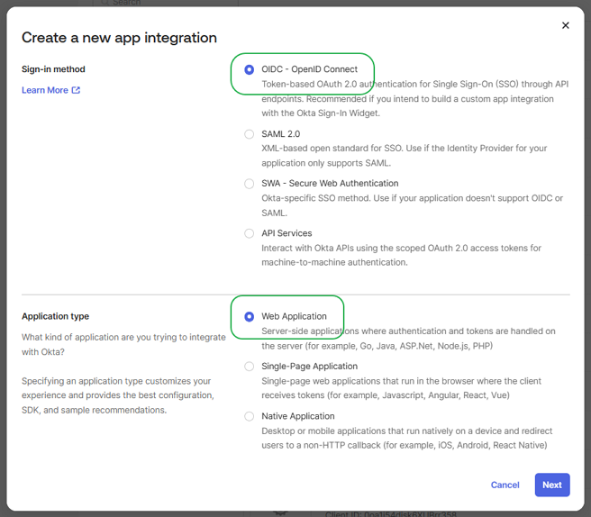
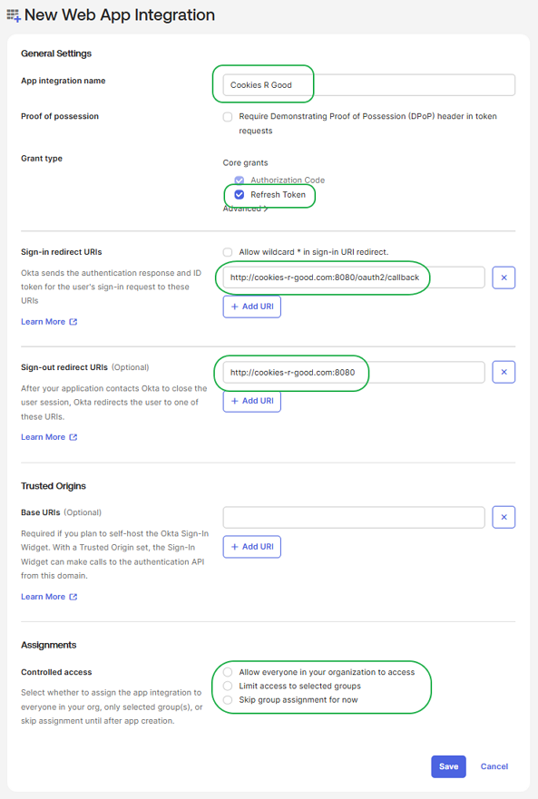
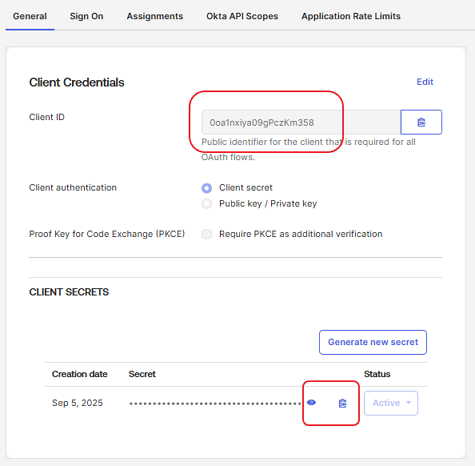

# okta-oauth2-proxy-statichtml
This is a simple Docker example for running Oauth2 Proxy, using Okta for security, to host a static HTML site.  If your just wanting to get a very simple site up and running, and be able to use Okta to authenticate, I found this to work for me.

> This is a simplified example based on [Okta OAuth2 Proxy Example](https://github.com/oktadev/okta-oauth2-proxy-example).  That example shows how to use OAuth2 Proxy with Nginx, a trivial Spring application, and Redis.  Its useful if you need something more complex, but I just wanted something to serve static HTML.

I just wanted to be able to do this:

1. Serve static HTML
2. Provide authentication via Okta
3. Be able to host it behind a particular port, since I'm just serving my site from home, and I don't want to host my site on port 80.
4. Run via a dead simple Docker

Most examples I found had a reverse-proxy web server, like Nginx or Caddy, with a separate application that would communicate with Okta.  I tried to get those to work, but had problems as none of them had enough instructions that I was able to get everything to work quite right with my setup.

By using OAuth2 Proxy to both serve HTML and authenticate with Okta, I was able to get it up   It can authenticate with a bunch of other providers too if thats what you need.

**Prerequisites:** 
* [Docker](https://docs.docker.com/get-docker/)
* [Docker Compose](https://docs.docker.com/compose/install/) (optional)
* [Okta](https://developer.okta.com/) has Authentication and User Management APIs that reduce development time with instant-on, scalable user infrastructure. Okta's intuitive API and expert support make it easy for developers to authenticate, manage, and secure users and roles in any application.  Okta provides free accounts you can sign-up for testing.

**Uses**
* [OAuth2 Proxy](https://oauth2-proxy.github.io/oauth2-proxy/) - A reverse proxy and static file server that provides authentication using Providers (Google, GitHub, and others) to validate accounts by email, domain or group.  This will be run via a Docker image, so there is no need to install it.

## Getting Started

### Create an Application in Okta

> Before you begin, you'll need access to be able to create applications in Okta. You can sign up for free developer accounts for testing.

Once you have logged into Okta, create a new Application. Select the following information:



On the following page you need to provide a few values:

1. A name for you app
1. Select **Refresh Token** (optional)
1. Specify a **Sign-in redirect URI**.  In the example below I used `http://cookies-r-good.com:8080/oauth2/callback`.  You should replace `cookies-r-good.com:8080` with the host and port that you'll be running your site on. For local testing, you can actually use localhost and a port of your choosing.
1. Specify a **Sign-out redirect URIs**.  Similar to the above, but without the callback portion of the path.
1. And finally select an option for **Controlled access**.  Any choice is fine at this point.  Can always add users later.



After saving on the previous page, you need to get two values on the next page:

1. Client ID
2. Client Secret



### Create a Cookie Secret

The examples will need a 32 bit cookie secret value. There are various ways to create this, but this was one of the easiest ways:

```bash
openssl rand -base64 32
```

You'll end up with a value like: `wtxah54zYQDMh6kMQq8Adomy+zQ/Amhtoh2nHwu3DSc=` which you'll want to use in the following examples.

### Examples

There are different examples you can use to execute this, pick whichever one is right for you.

1. [Run with **docker run**](examples/docker-run)
2. [Run with **docker compose**](examples/docker-compose)


## SSL Support

At the time I wrote this, I did not have SSL working. OAuth2 Proxy does support it, and I tried to configure it, but it wasn't working for some reason.  If you can figure out a way to handle it, especially when you aren't running on port 443, feel free to submit a change.

I know there is some documenation online you can find where you can use Nginx or Caddy as a the SSL termination, and then you could proxy to OAuth2 Proxy for authentication. But the examples I found were able to use subdomains and I'm just running a home server on a static IP. I don't have subdomains and didn't want to mess with that.

## Help

None really. These examples are about as simple as you can get. More document is available for [OAuth2 Proxy](https://oauth2-proxy.github.io/oauth2-proxy/)

## License

Unlicense, see [LICENSE](LICENSE).  Like I was going to license this example.
